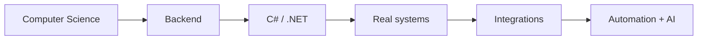

from pathlib import Path

readme = r'''<div align="center">

# Hi, I'm Matteo 👋

### Computer Science @ UFMS • Backend Development • C# / .NET

Building backend systems, integrations, automation and applied AI — while turning academic ideas into real projects.

[](https://github.com/TeoZ08)
[](https://github.com/TeoZ08)
<!-- Replace the URL below with your LinkedIn profile -->
[](YOUR_LINKEDIN_URL)

</div>

---

## `$ whoami`

```txt
name      Matteo Lima Scotti
location  Campo Grande, MS — Brazil
degree    Computer Science @ UFMS
role      Backend Development Intern
focus     C# • .NET • APIs • integrations • software engineering
```

I like projects that connect **software engineering with something tangible**: backend services, device/system integrations, automation, AI-assisted workflows and interactive experiences.

Right now, most of my attention is on **C#/.NET backend development**, while I keep experimenting with web, infrastructure and applied AI.

---

## ⚙️ Core stack

<div align="center">


</div>

### Also building with

<div align="center">


</div>

---

## 🧭 What I'm working on

- **Backend engineering** with C# and the .NET ecosystem.
- **REST APIs, business rules and persistence** in real systems.
- **System/device integrations** and data flows between software and external equipment.
- **Automation and AI workflows** for practical tasks.
- **Computer Science at UFMS**, connecting theory with projects whenever possible.

---

## 🚀 Selected projects

<table>
<tr>
<td width="50%" valign="top">

### 🤖 JARVIS Acadêmico
Academic assistant built around **RAG, LLMs and tool calling**, combining retrieval with a web interface.

`React` `FastAPI` `Python` `RAG` `LLMs` `Docker`

[View repository →](https://github.com/TeoZ08/jarvis-academico)

</td>
<td width="50%" valign="top">

### 👵 UNAPI
Technology and digital inclusion work connected to UFMS extension activities, including interactive materials and practical workshops.

`Web` `Accessibility` `Digital Inclusion` `Education`

[Explore my repositories →](https://github.com/TeoZ08?tab=repositories)

</td>
</tr>

<tr>
<td width="50%" valign="top">

### 💧 AquaIA
Academic project combining software and applied AI, created in the UFMS environment.

`Python` `Flask` `Gemini` `SQLite` `Leaflet`

[View repository →](https://github.com/TeoZ08/aquaia_ufms)

</td>
<td width="50%" valign="top">

### 🛍️ useART
E-commerce project exploring a complete product flow, authentication, database and deployment.

`Next.js` `TypeScript` `Supabase` `PostgreSQL`

[View repository →](https://github.com/TeoZ08/useART)

</td>
</tr>
</table>

---

## 🧪 Current lab

Things I'm actively studying, testing or applying:

```text
Backend        C# • .NET • EF Core • APIs • repositories • business rules
Data           SQL • PostgreSQL • MongoDB
Infrastructure Docker • Linux • Kubernetes concepts
AI             RAG • LLM integrations • agents • automation
Web            Next.js • React • TypeScript
Networks       TCP/IP • P2P • device communication • local integrations
```

---

## 📊 GitHub snapshot

<div align="center">


</div>

> Stats are fun. Shipping useful things matters more.

---

## 🎯 2026



My current goal is simple: **get progressively better at building reliable software, understanding the systems behind it, and documenting what I learn along the way.**

---

<div align="center">

### `build → test → understand → improve`

<sub>Matteo Lima Scotti • Campo Grande, MS 🇧🇷</sub>

</div>
'''

path = Path("/mnt/data/README.md")
path.write_text(readme, encoding="utf-8")
print(path)
